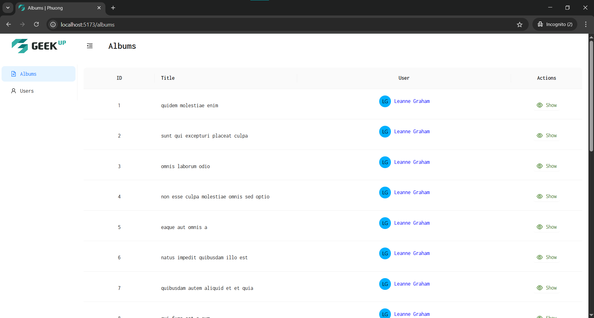
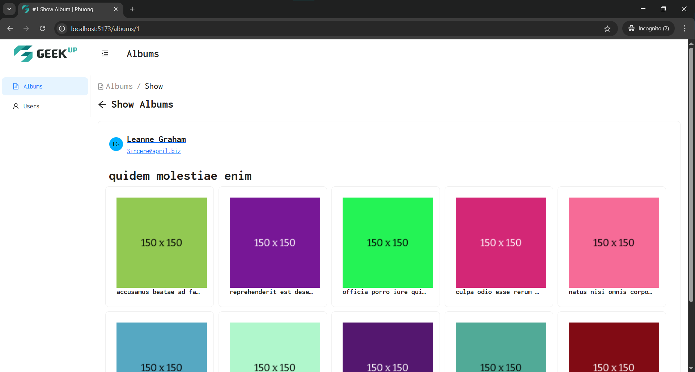
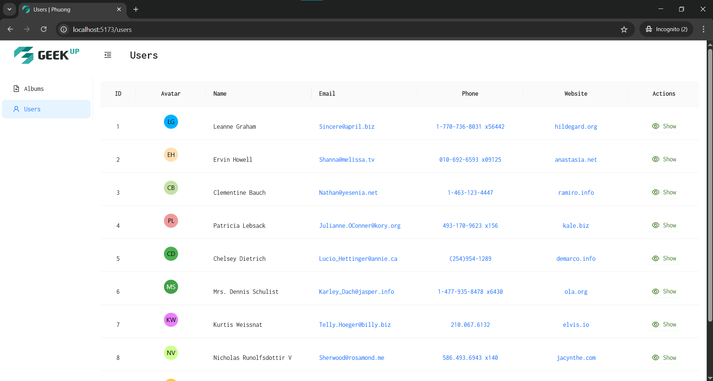
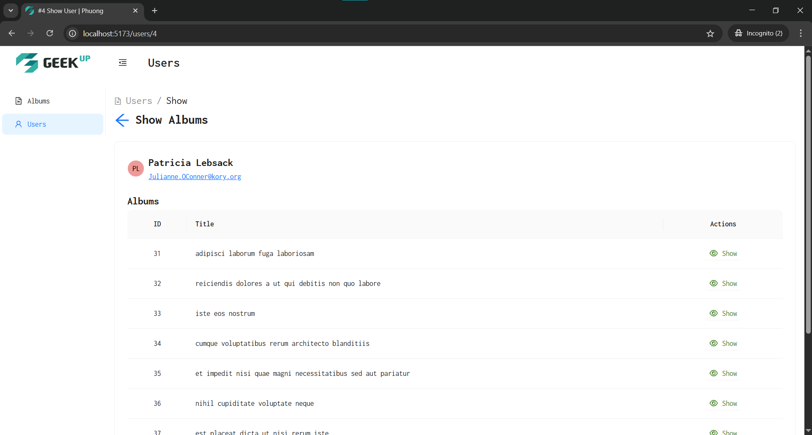

## Overview

This project is a web application built with **React** and uses **Ant Design** for UI components.

## Libraries & Tools Used

- **React**: Main JavaScript library for building user interfaces.
- **Ant Design**: Provides a rich set of UI components for fast and beautiful development.
- **Axios**: For making HTTP requests to APIs.
- **React Router DOM**: For client-side routing.
- **Other tools**: Prettier, etc. for code quality and formatting.

**Why these tools?**

- **React** is widely adopted, component-based, and easy to maintain.
- **Ant Design** offers a modern, consistent, and customizable UI.

## Project Structure

```
src/
  ├── component/      # React components (Albums, Users)
  ├── global/         # Shared components (ActionButtons)
  ├── home/           # Layout and navigation (Sidebar, Header)
  ├── layout/         # Main layout components
  ├── page/           # Page-level components (Loading)
  ├── plugin/         # Axios and other plugins
  └── App.js          # Main app entry
```

## How to Set Up & Start the Project

### 1. Clone the repository

```bash
git clone https://github.com/NamPhuong104/GeekUp.git
cd GeekUp
```

### 2. Install dependencies

```bash
npm install
# or
yarn install
```

### 3. Start the development server

```bash
npm run dev
# or
yarn dev
```

The app will be available at [http://localhost:5173](http://localhost:5173) (or the port specified in your config).

### 4. Build for production

```bash
npm run build
# or
yarn build
```

## Submission

- **Include**: Source code (excluding `node_modules`, `vendor`, `.git`, built, and minified files).
- **Compress**: The project folder into a `.zip` file.
- **README.md**: This file describes setup and your approach.

---

### 5. The result runs in local






### 6. Run on production

https://namphuong104-geekup-assessment.netlify.app/
